# NCEC AI Platform — Enterprise Document Intelligence

A production-ready **demo dashboard** prepared by **Spark Technologies** for the **National Center for Environmental Compliance (NCEC)**. It covers the full **Phase 1 — AI Knowledge Platform** scope from the July 2026 discovery meeting, with bilingual (English / Arabic) UI, role-based access, and interactive workflows powered by illustrative demo data.

> **Demo notice:** This is a front-end demonstration. AI responses, document processing, and exports are simulated client-side. In production, each module connects to on-premise services (local LLMs, vector store, OCR engine, LDAP).

---

## Table of Contents

1. [Quick Start](#quick-start)
2. [Deployment](#deployment)
3. [Demo Login](#demo-login)
4. [Scope Coverage](#scope-coverage)
5. [Technology Stack](#technology-stack)
6. [Application Routes](#application-routes)
7. [Role-Based Access Control](#role-based-access-control)
8. [Architecture & Flow Diagrams](#architecture--flow-diagrams)
9. [Module Workflows](#module-workflows)
10. [Dashboard KPIs](#dashboard-kpis)
11. [Knowledge Base Document Types](#knowledge-base-document-types)
12. [Local AI Model Registry](#local-ai-model-registry)
13. [Project Structure](#project-structure)
14. [Build & Quality Checks](#build--quality-checks)

---

## Quick Start

```bash
# Install dependencies
npm install

# Start development server (default http://localhost:5173)
npm run dev

# Production build
npm run build

# Preview production build locally
npm run preview

# Lint
npm run lint
```

**Requirements:** Node.js 18+ (20+ recommended), npm 9+

---

## Deployment

The app uses **HashRouter** (`/#/…`), so it deploys as a static site with no server-side routing configuration required.

### Build output

| Artifact | Path | Size (approx.) |
|----------|------|----------------|
| Entry HTML | `dist/index.html` | ~0.7 KB |
| Styles | `dist/assets/*.css` | ~48 KB (gzip ~9 KB) |
| JavaScript bundle | `dist/assets/*.js` | ~945 KB (gzip ~274 KB) |

### Vercel (recommended)

A `vercel.json` is included. Connect the repository to Vercel — it auto-detects Vite:

| Setting | Value |
|---------|-------|
| Build Command | `npm run build` |
| Output Directory | `dist` |
| Framework | Vite |

```bash
# Optional: deploy via Vercel CLI
npx vercel --prod
```

### Netlify

| Setting | Value |
|---------|-------|
| Build command | `npm run build` |
| Publish directory | `dist` |

### Nginx (on-premise)

```nginx
server {
    listen 80;
    server_name ncec-ai.internal;
    root /var/www/ncec-ai-platform/dist;
    index index.html;

    location / {
        try_files $uri $uri/ /index.html;
    }
}
```

### Docker (static serve)

```dockerfile
FROM node:20-alpine AS build
WORKDIR /app
COPY package*.json ./
RUN npm ci
COPY . .
RUN npm run build

FROM nginx:alpine
COPY --from=build /app/dist /usr/share/nginx/html
EXPOSE 80
```

### Deployment readiness checklist

| Check | Status |
|-------|--------|
| `npm run build` passes (TypeScript + Vite) | ✅ |
| `npm run lint` passes | ✅ |
| HashRouter — no SSR / API dependency | ✅ |
| Session auth via `sessionStorage` | ✅ |
| `vercel.json` included | ✅ |
| `.gitignore` excludes `node_modules`, `dist` | ✅ |
| Bilingual RTL/LTR support | ✅ |
| All 19 scope modules represented | ✅ |

---

## Demo Login

Sign in at `/#/login`. Any password is accepted in demo mode.

| Persona | Email | Role ID | Role |
|---------|-------|---------|------|
| Ahmed Al-Khalidi | a.khalidi@ncec.gov.sa | ROLE-01 | Super Admin |
| Khalid Al-Shehri | k.shehri@ncec.gov.sa | ROLE-02 | Department Manager |
| Sara Al-Otaibi | s.otaibi@ncec.gov.sa | ROLE-03 | Reviewer |
| Mona Al-Harbi | m.harbi@ncec.gov.sa | ROLE-04 | Legal Team |
| Fahad Al-Dossary | f.dossary@ncec.gov.sa | ROLE-05 | Technical Team |
| Noura Al-Qahtani | n.qahtani@ncec.gov.sa | ROLE-06 | Environmental Team |
| James Carter | j.carter@consultant.ext | ROLE-07 | External Consultant |
| Guest Viewer | viewer@ncec.gov.sa | ROLE-08 | Read Only |

Default demo password: `NCEC-demo-2026`

---

## Scope Coverage

All 19 Phase 1 modules from the NCEC discovery meeting are implemented in the demo UI:

| # | Scope Module | App Route | Key Capabilities |
|---|--------------|-----------|------------------|
| 1 | Central Knowledge Base | `/knowledge-base` | Upload PDF/DOCX/XLS, indexing, metadata |
| 2 | AI Document Assistant | `/assistant` | NL chat, citations, page refs, KB scope toggle |
| 3 | Arabic Document Intelligence | `/assistant`, `/ocr`, `/search` | Arabic OCR, semantic search, RTL UI |
| 4 | Environmental Study Analysis | `/environmental-studies` | 500+ page EIA review, exec summary, reports |
| 5 | Regulatory & Legal AI | `/regulatory` | Conflict detection, clause comparison, drafting |
| 6 | Document Generation | `/generation` | Regulations, policies, memos — DOCX/PDF export |
| 7 | Document Review | `/review` | Completeness, compliance, readiness scoring |
| 8 | Recommendation Engine | `/recommendations` | Approve / reject / revise with confidence |
| 9 | AI Legal Assistant | `/legal-assistant` | Legal Q&A, clause explanation, case lookup |
| 10 | Data Analysis | `/data-analysis` | Excel/CSV upload, trends, anomalies, forecast |
| 11 | Search Engine | `/search` | Semantic, keyword, hybrid search with filters |
| 12 | Workflow Automation | `/workflows` | Review, approval, assignment, status tracking |
| 13 | RBAC | `/admin` | 8 roles, module + action permissions |
| 14 | Security | `/admin` | On-premise, audit logs, encryption, AD/LDAP |
| 15 | AI Model Requirements | `/admin` | Local LLM registry (Ollama/vLLM) |
| 16 | OCR Module | `/ocr` | Arabic/English scanned docs, tables, forms |
| 17 | Knowledge Management | `/knowledge-base`, `/admin` | Indexing, versioning, related docs |
| 18 | Dashboard | `/` | KPIs, alerts, charts, role-adaptive views |
| 19 | Administration | `/admin` | Users, departments, models, backup/restore |

---

## Technology Stack

| Layer | Technology | Version |
|-------|------------|---------|
| Build tool | Vite | 8.x |
| UI framework | React | 19.x |
| Language | TypeScript | 6.x |
| Styling | Tailwind CSS | 4.x |
| Routing | React Router (HashRouter) | 7.x |
| Charts | Recharts | 3.x |
| Icons | Lucide React | 1.x |
| Linting | Oxlint | 1.x |
| Document export | Client-side OOXML (DOCX) + print-to-PDF | — |

---

## Application Routes

| Group | Route | Page Component |
|-------|-------|----------------|
| Auth | `/login` | `Login.tsx` |
| Overview | `/` | `Dashboard.tsx` |
| AI Workspace | `/assistant` | `DocAssistant.tsx` |
| AI Workspace | `/legal-assistant` | `LegalAssistant.tsx` |
| AI Workspace | `/search` | `SearchPage.tsx` |
| AI Workspace | `/data-analysis` | `DataAnalysis.tsx` |
| Documents | `/knowledge-base` | `KnowledgeBase.tsx` |
| Documents | `/environmental-studies` | `EnvStudies.tsx` |
| Documents | `/regulatory` | `RegulatoryAI.tsx` |
| Documents | `/generation` | `DocGeneration.tsx` |
| Documents | `/review` | `DocReview.tsx` |
| Documents | `/ocr` | `OCRPage.tsx` |
| Operations | `/recommendations` | `Recommendations.tsx` |
| Operations | `/workflows` | `Workflows.tsx` |
| Administration | `/admin` | `Admin.tsx` |

---

## Role-Based Access Control

### Permission flags

| Permission | Description |
|------------|-------------|
| `upload` | Upload documents to knowledge base |
| `chat` | Use AI assistants (document + legal) |
| `generate` | Generate documents from templates |
| `approve` | Approve workflows and recommendations |
| `admin` | Access Admin & Security module |

### Role × Permission matrix

| Role | ID | Upload | Chat | Generate | Approve | Admin | Modules |
|------|----|--------|------|----------|---------|-------|---------|
| Super Admin | ROLE-01 | ✅ | ✅ | ✅ | ✅ | ✅ | All 14 |
| Department Manager | ROLE-02 | ✅ | ✅ | ✅ | ✅ | ❌ | 13 |
| Reviewer | ROLE-03 | ✅ | ✅ | ✅ | ❌ | ❌ | 9 |
| Legal Team | ROLE-04 | ✅ | ✅ | ✅ | ❌ | ❌ | 9 |
| Technical Team | ROLE-05 | ✅ | ✅ | ❌ | ❌ | ❌ | 7 |
| Environmental Team | ROLE-06 | ✅ | ✅ | ❌ | ❌ | ❌ | 8 |
| External Consultant | ROLE-07 | ❌ | ✅ | ❌ | ❌ | ❌ | 4 |
| Read Only | ROLE-08 | ❌ | ❌ | ❌ | ❌ | ❌ | 3 |

### RBAC enforcement points

| Layer | Mechanism | File |
|-------|-----------|------|
| Route guard | Redirect to `/login` if unauthenticated | `Layout.tsx` |
| Module guard | `AccessGate` blocks unauthorized routes | `Layout.tsx` |
| Sidebar filter | Nav items filtered by `role.modules` | `Layout.tsx` |
| Action gating | Buttons/inputs check `role.perms` | Per-page components |
| Role switcher | Header dropdown for live RBAC preview | `Layout.tsx` |

---

## Architecture & Flow Diagrams

### 1. On-Premise System Architecture

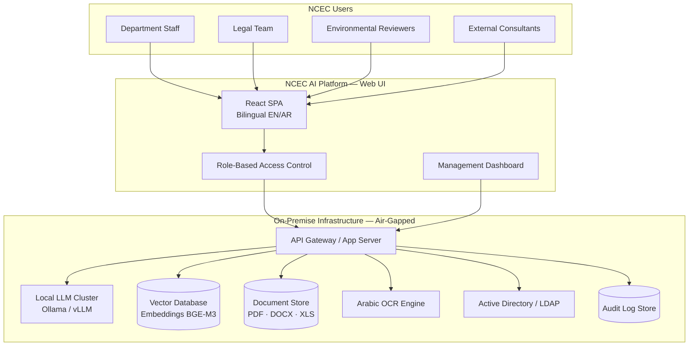

### 2. Authentication & Session Flow

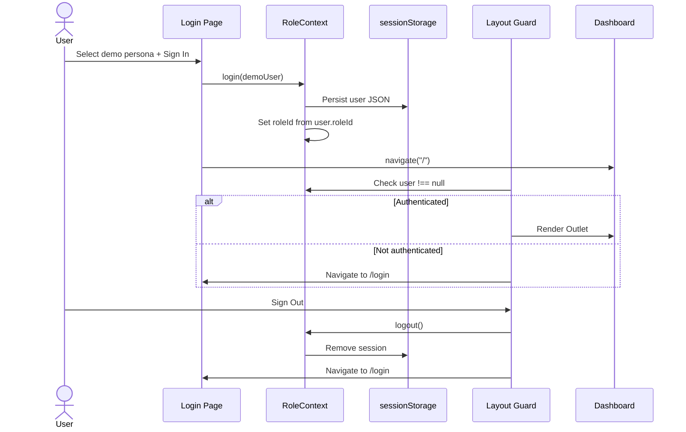

### 3. Document Ingestion & Indexing Pipeline

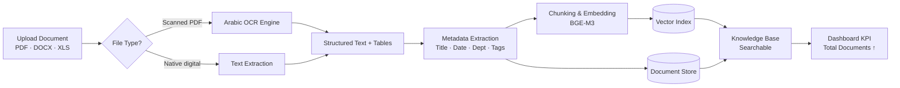

### 4. AI Document Assistant — RAG Q&A Flow

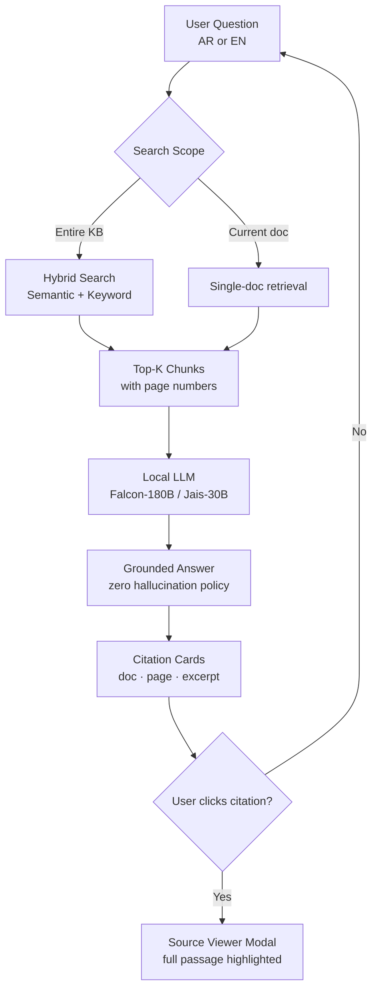

### 5. Environmental Study Analysis Workflow

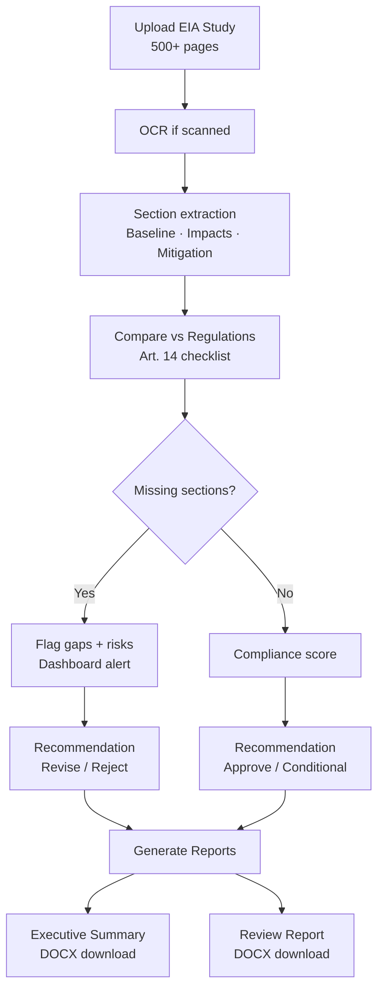

### 6. Regulatory Conflict Detection Flow

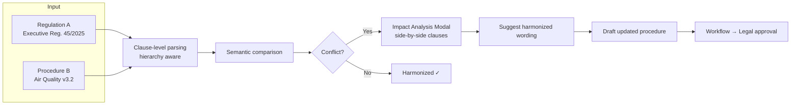

### 7. Document Generation Workflow

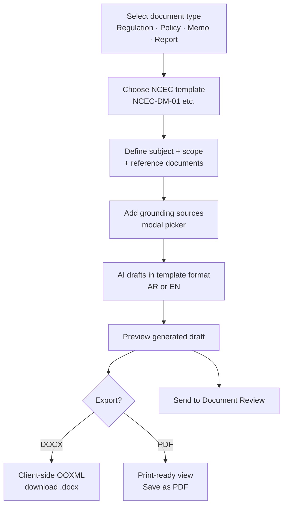

### 8. Document Review Workflow

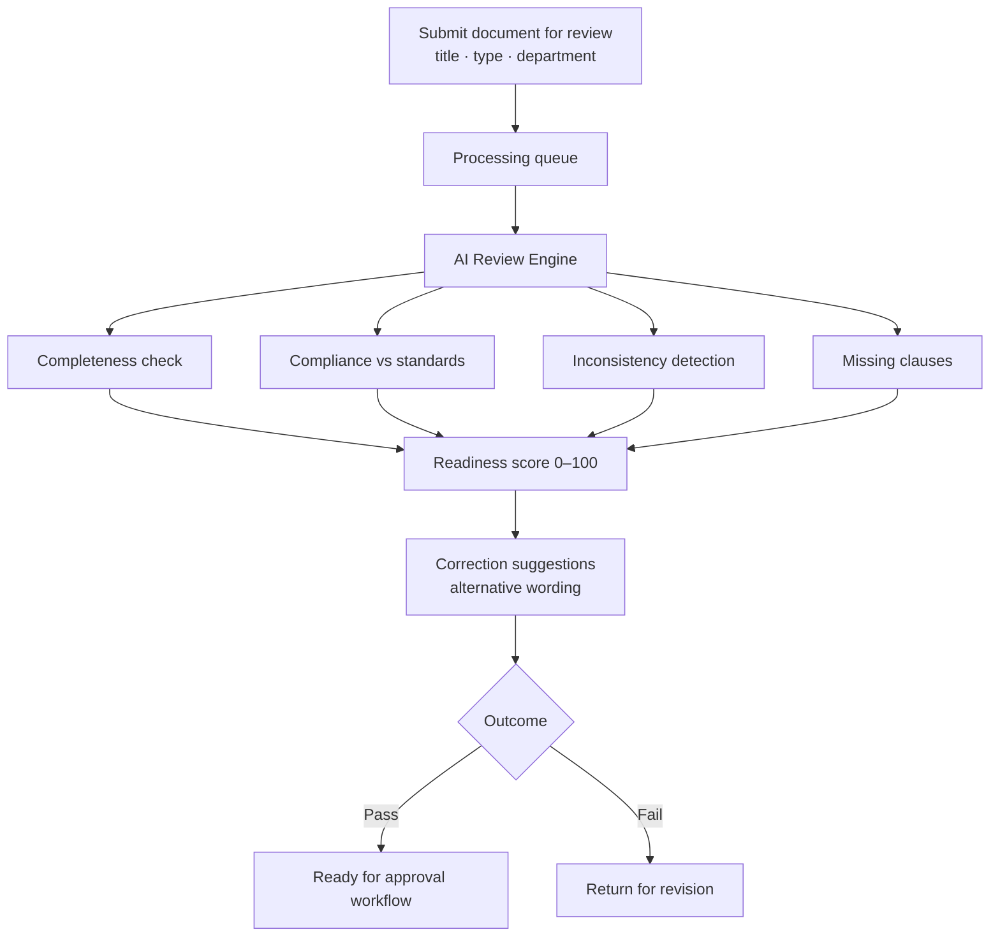

### 9. Recommendation Engine Flow

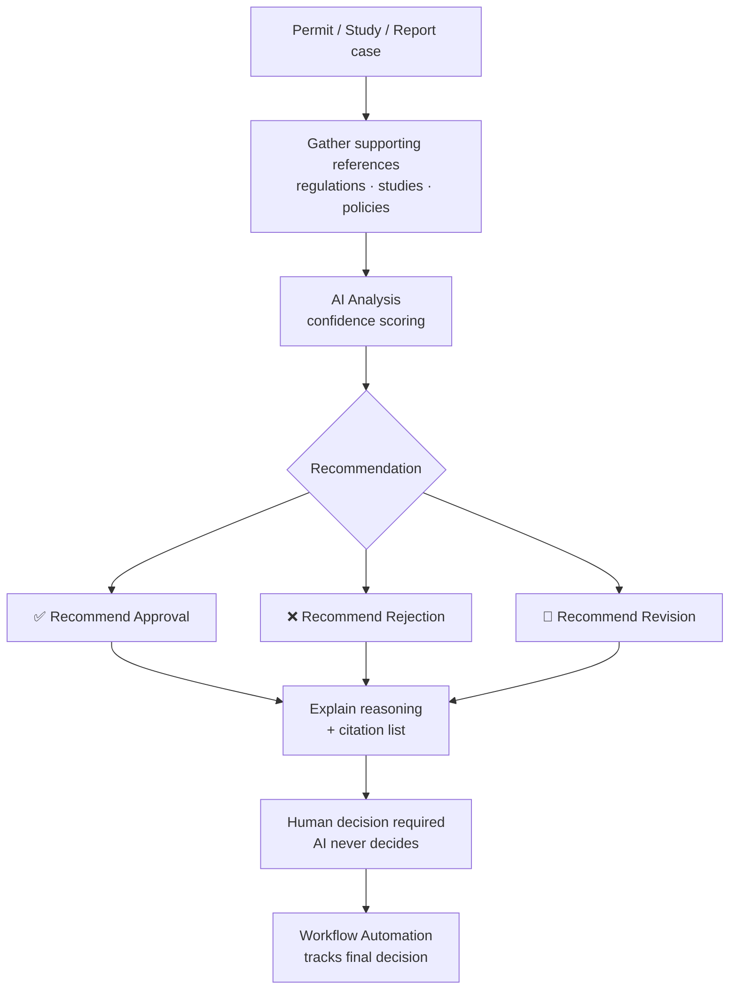

### 10. Enterprise Search Flow

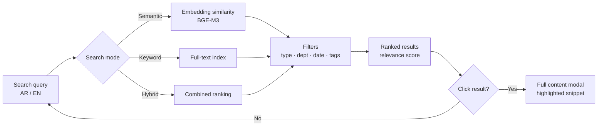

### 11. OCR Processing Pipeline

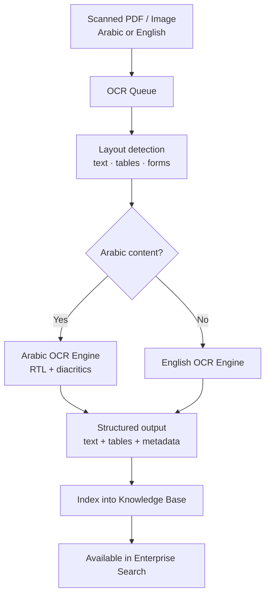

### 12. Deployment Pipeline

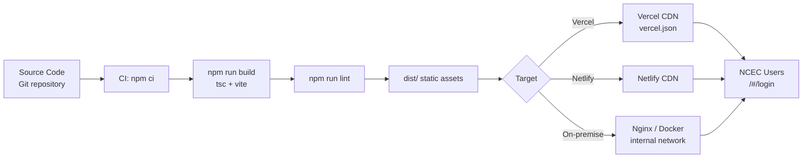

---

## Module Workflows

### Interactive demo features by module

| Module | Interactive Features |
|--------|---------------------|
| Dashboard | Clickable KPI cards → navigate to module; Live alerts → impact analysis modal; KB pie chart → category details |
| AI Document Assistant | KB scope toggle; citation links → source viewer with full passage |
| Enterprise Search | Click result → full content modal |
| Environmental Studies | Executive Summary / Review Report → DOCX download |
| Regulatory & Legal AI | Full comparison → side-by-side conflict modal |
| Document Generation | Add references modal; DOCX + PDF export |
| Document Review | Review Document form → progress → readiness score |
| Admin & Security | Add User modal; View as role preview modal |
| All KPI cards | Sparkline charts on hover across modules |

---

## Dashboard KPIs

| KPI | Default Value | Click navigates to |
|-----|---------------|-------------------|
| Total Documents | 11,440 | `/knowledge-base` |
| AI Queries Today | 2,463 | `/assistant` |
| Active Users | 284 | `/admin` |
| Searches / Week | 23.4K | `/search` |
| Processing Queue | 47 | `/ocr` |
| Reviews Completed | 1,208 | `/review` |
| Active Workflows | 36 | `/workflows` |
| Model Accuracy | 96.2% | `/admin` |

KPI visibility adapts per role (e.g., Read Only sees fewer cards).

---

## Knowledge Base Document Types

| Type | Count | Share | Recent Uploads (demo) |
|------|-------|-------|----------------------|
| Regulations | 3,120 | 27.3% | 48 |
| Environmental Studies | 1,840 | 16.1% | 23 |
| Policies & SOPs | 2,260 | 19.8% | 31 |
| Legal Documents | 1,470 | 12.8% | 19 |
| Technical Manuals | 980 | 8.6% | 12 |
| Circulars & Other | 1,770 | 15.5% | 27 |
| **Total** | **11,440** | **100%** | **160** |

---

## Local AI Model Registry

| Model | Purpose | Latency (demo) | Load |
|-------|---------|----------------|------|
| Falcon-180B (AR/EN) | Document QA & drafting | 1.2s | 68% |
| Jais-30B Arabic | Arabic legal reasoning | 0.9s | 54% |
| BGE-M3 Embeddings | Semantic search & RAG | 0.1s | 41% |
| Arabic OCR Engine | Scanned docs & tables | 2.4s | 77% |

All models run locally — **zero external API calls**.

---

## Project Structure

```
ncec-ai-platform/
├── public/                  # Static assets (favicon, icons)
├── src/
│   ├── App.tsx              # Routes (HashRouter)
│   ├── main.tsx             # Entry point
│   ├── index.css            # Tailwind + theme variables
│   ├── i18n.tsx             # EN/AR translations + RTL
│   ├── roles.tsx            # RBAC roles, demo users, auth context
│   ├── components/
│   │   ├── Layout.tsx       # Sidebar, header, route guard
│   │   └── ui.tsx           # KpiCard, Card, Modal, Button, charts
│   ├── pages/               # One page per module (14 pages)
│   └── utils/
│       └── docExport.ts     # Client-side DOCX/PDF export
├── vercel.json              # Vercel deployment config
├── vite.config.ts
├── package.json
└── README.md
```

---

## Build & Quality Checks

```bash
# Full production verification
npm run build && npm run lint && npm run preview
```

| Script | Command | Purpose |
|--------|---------|---------|
| `dev` | `vite` | Local development with HMR |
| `build` | `tsc -b && vite build` | Type-check + production bundle |
| `preview` | `vite preview` | Serve `dist/` locally |
| `lint` | `oxlint` | Static analysis |

---

## Key Design Principles

| Principle | Implementation |
|-----------|----------------|
| On-premise first | No cloud AI APIs; local LLM narrative throughout UI |
| Citation-first AI | Every answer links to source doc + page number |
| Human-in-the-loop | Recommendation engine advises — never auto-decides |
| Bilingual | Full EN/AR with RTL layout via `document.documentElement.dir` |
| Modular | Each of 19 scope areas maps to a dedicated page |
| RBAC | 8 roles with module routes + 5 action permissions |

---

**Prepared by Spark Technologies for NCEC — July 2026 Discovery Meeting**
